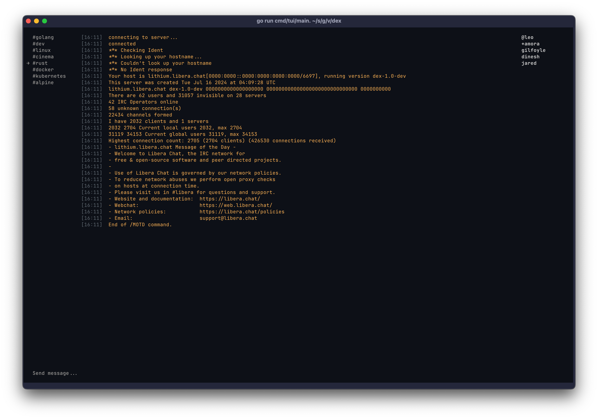

## dex

## reference
https://datatracker.ietf.org/doc/html/rfc2812

## TODO
* IRC:
  * reconnect on disconnect
  * show user joins/parts in buffer -> add a field so it's possible for the user to choose have it or not
  * option to don’t connect to the channels on startup
  * option to change timestamp format and/or hide it
  * enable scroll to viewport (chat or user list) based on the mouse is hovered
  * support for commands, e.g. /leave, /join, etc.
  * autocompletion for commands
  * put operators first in the user list
* check if the chat being updated every message is a performance issue
* maybe centralize all paddings and borders numbers
* centralize and improve all styles in the styles package, make sure there are no loose styles
* implement command palette actions
* implement a new overlay: help with all the keybindings - will only be shown in the command palette
* migrate to lipgloss v2 and use their overlay
* fix mouse sequences being typed in input bar e.g. `[<64;76;47M[<65;76;47M`
* use all models as value and not reference
* config: global nickname option
* find a place to display channel modes if the user wants to
* create keybindings for scrolling the chat viewport
* option to disable mouse/scroll support
* new messages indicator
* tagged messages indicator
* improve channel list UI and user list member count, it's kinda ugly - ask for suggestions to someone
* improve ctrl+c quit color

## Features to implement
* command palette with: quick jump, fuzzy channel search, join, leave, etc.
* ability to open vim in input to edit the message being sent
* spell checking in input
* option to show only channels with unread messages
* a new pane on top of the channel list with: buffer for all your DMs and tagged messages
* channel topic: config option to truncate to one line
* config file where user can set: themes, servers, etc.
* support natively most used weechat plugins: exec, alias, spell, logger, etc
* multiple lines paste confirmation -> option to upload it to pastebin and then send the link
* sound notification support
